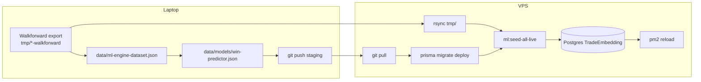

# ML / RAG Deploy Playbook

**Scope:** Operasional — deploy WinPredictor + TradeEmbedding ke VPS setelah walkforward / retrain.  
**Technical companion:** [`RAG.md`](./RAG.md) (konsep gate, arsitektur).  
**Doc date:** 2026-07-28

---

## Ringkasan (Bahasa Indonesia)

RAG di Quantara butuh **dua artefak terpisah**:

| Artefak | Lokasi | Masuk git? |
|---------|--------|------------|
| Model WinPredictor | `data/models/win-predictor.json` | ✅ Ya |
| Embedding trade (retrieval) | Postgres `TradeEmbedding` + pgvector | ❌ Tidak — seed di VPS |

CSV walkforward ada di **`tmp/` lokal** (tidak di-commit). Seed **harus** jalan di VPS — `DATABASE_URL` laptop menunjuk localhost yang tidak punya Postgres/pgvector.

**Satu perintah dari laptop (staging):**

```bash
npm run ml:deploy-rag-staging
```

Perintah ini: rsync `tmp/*-walkforward` → VPS → `git pull` → `prisma migrate deploy` → seed 12 strategi → reload PM2.

---

## Alur end-to-end



**Urutan yang benar:**

1. **Lokal:** export walkforward → (opsional) train model → commit + push model ke git.
2. **Laptop → VPS:** `npm run ml:deploy-rag-staging` (atau dev).
3. **Verifikasi:** health + rag-gate-status.

---

## Prerequisites

### Laptop

- SSH ke VPS: `VPS_HOST=root@187.77.135.156` (default di script).
- Folder `tmp/<prefix>-{scalping|intraday|swing}-walkforward/` sudah terisi (dari `scripts/walkforward/`).
- Node 18+ dan `npm ci` sudah pernah jalan di repo.

### VPS (staging / dev)

| Env | Path checkout | Branch git | PM2 app | Port |
|-----|---------------|------------|---------|------|
| **staging** | `/opt/quantara-staging/be` | `staging` | `be-quantara-staging` | 3001 |
| **dev** | `/opt/quantara-dev/be` | `development` | `be-quantara-dev` | 3002 |
| prod | `/opt/quantara-prod/be` | `main` | `be-quantara-prod` | 3000 |

- `.env` di path checkout dengan `DATABASE_URL` Postgres **VPS** (bukan localhost laptop).
- Extension **pgvector** terpasang (via Prisma migrate).
- Tabel `TradeEmbedding` ada (migrate deploy).

---

## Kapan perlu retrain / redeploy?

| Trigger | Lokal | VPS deploy |
|---------|-------|------------|
| HTF / logic strategi berubah | Re-export walkforward, retrain model | `ml:deploy-rag-staging` |
| Strategi baru (12 → N) | Export + update preset | `--all-live` (sudah default) |
| Refresh walkforward saja | Export ulang tmp/ | `ml:deploy-rag-staging` (skip train OK) |
| Hanya migrate schema | — | deploy script (migrate + seed) |
| Model di git sudah baru, CSV sama | — | `--skip-train` (default npm script) |

---

## Quick start — one-liner

### Staging (paling sering)

```bash
# Dari root be-bot-trading di laptop:
npm run ml:deploy-rag-staging
```

Setara manual:

```bash
./scripts/ml/deploy-rag-vps.sh --env staging --from-walkforward --all-live --skip-train
```

### Development VPS

```bash
npm run ml:deploy-rag-dev
```

### Deploy sudah SSH ke VPS

Script **auto-detect** jika `pwd` = `/opt/quantara-{staging|dev}/be`: skip rsync + ssh, jalankan migrate/seed/PM2 lokal.

```bash
# Setelah CSV sudah di-rsync dari laptop:
cd /opt/quantara-dev/be
npm run ml:deploy-rag-dev

# Atau paksa mode lokal:
./scripts/ml/deploy-rag-vps.sh --env dev --from-walkforward --all-live --local
```

Jika `tmp/` di VPS kosong, script menampilkan perintah `rsync` exact dari laptop — **jangan** jalankan deploy dari VPS sebelum rsync.

**Preferred:** deploy dari laptop (`npm run ml:deploy-rag-staging`) agar rsync + seed satu langkah.

### Cek jumlah embedding (lokal, tanpa DB)

```bash
npm run ml:seed-all-live:dry-run
```

### Refresh model lokal + petunjuk deploy

```bash
npm run ml:full-rag-refresh
# lalu commit model, push, npm run ml:deploy-rag-staging
```

---

## Preset seed — 12 strategi LIVE

Semua preset dipakai oleh `seed-embeddings-from-walkforward.js` dan `deploy-rag-vps.sh`.

| Flag | Strategi | tmp/ prefix |
|------|----------|-------------|
| `--all-live` / `--seed-all` | **Semua 12** | smc, wyckoff, vsa, tf, ms, amt, mr, snd, sa, br, ict, ls |
| `--af-all` | AF tier | smc, wyckoff, vsa |
| `--ts-all` | TS tier | tf, ms, amt |
| `--md-all` | MD tier | mr, snd, sa |
| `--bs-all` | BS tier | br, ict, ls |
| `--tf-all`, `--smc-all`, … | Satu strategi × 3 trade type | lihat tabel di bawah |

### Mapping strategi → folder tmp/

| # | Strategy key | Abbrev tier | tmp prefix | Contoh path |
|---|--------------|-------------|------------|-------------|
| 1 | SMART_MONEY_CONCEPTS | AF | `smc` | `tmp/smc-intraday-walkforward/` |
| 2 | WYCKOFF | AF | `wyckoff` | `tmp/wyckoff-swing-walkforward/` |
| 3 | VOLUME_SPREAD_ANALYSIS | AF | `vsa` | `tmp/vsa-scalping-walkforward/` |
| 4 | TREND_FOLLOWING | TS | `tf` | `tmp/tf-intraday-walkforward/` |
| 5 | MARKET_STRUCTURE | TS | `ms` | `tmp/ms-intraday-walkforward/` |
| 6 | AUCTION_MARKET_THEORY | TS | `amt` | `tmp/amt-swing-walkforward/` |
| 7 | MEAN_REVERSION | MD | `mr` | `tmp/mr-scalping-walkforward/` |
| 8 | SUPPLY_AND_DEMAND | MD | `snd` | `tmp/snd-intraday-walkforward/` |
| 9 | STATISTICAL_ARBITRAGE | MD | `sa` | `tmp/sa-swing-walkforward/` |
| 10 | BREAKOUT_RETEST | BS | `br` | `tmp/br-intraday-walkforward/` |
| 11 | ICT_STYLE_TRADING | BS | `ict` | `tmp/ict-scalping-walkforward/` |
| 12 | LIQUIDATION_SQUEEZE | BS | `ls` | `tmp/ls-swing-walkforward/` |

Setiap strategi punya 3 trade type: `{prefix}-{scalping|intraday|swing}-walkforward`.

SSOT preset: `scripts/ml/walkforward-dir-presets.js`

---

## Step-by-step manual (fallback)

Jika one-command gagal, lakukan bertahap.

### A. Lokal — walkforward + train

```bash
# Export (contoh SMC intraday — ulangi per strategi atau pakai scripts/walkforward)
node scripts/walkforward/smart-money-concepts/intraday.js

# Opsional: train + commit model
npm run ml:train-win-predictor
git add data/models/win-predictor.json data/ml-engine-dataset.json
git commit -m "chore(ml): refresh win-predictor"
git push origin staging
```

### B. Rsync tmp ke VPS

```bash
rsync -avz tmp/smc-intraday-walkforward/ \
  root@187.77.135.156:/opt/quantara-staging/be/tmp/smc-intraday-walkforward/
# atau preset penuh via deploy script
```

### C. Di VPS — migrate + seed

```bash
ssh root@187.77.135.156
cd /opt/quantara-staging/be
git fetch origin staging && git reset --hard origin/staging
npm ci
npx prisma migrate deploy
npm run ml:seed-all-live
pm2 startOrReload ecosystem.config.js --only be-quantara-staging --update-env
```

### D. Verifikasi

```bash
curl -sf http://127.0.0.1:3001/health
# rag-gate-status butuh JWT:
curl -H "Authorization: Bearer <token>" \
  https://staging.quantara.software/api/v1/backtest/rag-gate-status
```

---

## npm scripts (baru)

| Script | Fungsi |
|--------|--------|
| `ml:deploy-rag-staging` | Full deploy staging (rsync + migrate + seed all + PM2) |
| `ml:deploy-rag-dev` | Sama untuk dev VPS |
| `ml:seed-all-live` | Seed 12 strategi (jalan di mesin dengan DATABASE_URL valid) |
| `ml:seed-all-live:dry-run` | Hitung embedding tanpa tulis DB |
| `ml:full-rag-refresh` | Dry-run count + train lokal + instruksi deploy |

---

## Apa yang masuk git vs lokal

| Path | Git | Catatan |
|------|-----|---------|
| `data/models/win-predictor.json` | ✅ | Model gate — pull di VPS |
| `data/ml-engine-dataset.json` | ✅ | Cache training |
| `tmp/*-walkforward/` | ❌ | CSV export — rsync ke VPS |
| `.env` | ❌ | Secrets + DATABASE_URL per env |
| Postgres `TradeEmbedding` | ❌ | Hanya di DB VPS |

**Jangan** commit `tmp/` atau `.env`.

---

## Dev vs staging vs prod

| | staging | development | production |
|---|---------|-------------|------------|
| Branch | `staging` | `development` | `main` |
| Deploy ML script | `ml:deploy-rag-staging` | `ml:deploy-rag-dev` | Manual / change window |
| ML_GATE_MODE tipikal | `shadow` | `shadow` / off | `active` hanya setelah promosi |
| RAG backtest UI | ON (`RAG_BACKTEST_ENABLED`) | ON | Sesuai policy |

**Branch confusion:** push fitur ML ke **`staging`** dulu, deploy staging, lalu merge ke **`development`** untuk dev VPS. Prod (`main`) terpisah.

---

## Troubleshooting

### `pgvector extension missing`

```bash
cd /opt/quantara-staging/be
npx prisma migrate deploy
# verify:
psql "$DATABASE_URL" -c "SELECT * FROM pg_extension WHERE extname='vector';"
```

### `ECONNREFUSED` / `Cannot connect to Postgres at localhost`

Seed dijalankan di **laptop** — salah. Harus:

- `npm run ml:deploy-rag-staging` (seed di VPS via SSH), atau
- SSH ke VPS lalu `npm run ml:seed-all-live`

### `TradeEmbedding table missing`

```bash
npx prisma migrate deploy
```

Pastikan branch VPS sudah pull commit yang punya migration TradeEmbedding.

### `No local tmp/*-walkforward dirs found`

Deploy dijalankan **di VPS** tanpa CSV — `tmp/` hanya ada di laptop.

```bash
# Dari laptop (preferred):
npm run ml:deploy-rag-dev

# Atau rsync manual dulu, lalu di VPS:
rsync -avz tmp/tf-scalping-walkforward/ root@187.77.135.156:/opt/quantara-dev/be/tmp/tf-scalping-walkforward/
```

### `No trades.csv under tmp/...`

Walkforward belum di-export lokal, atau rsync gagal.

```bash
npm run ml:seed-all-live:dry-run   # cek file lokal
ls tmp/*-walkforward/**/trades.csv | head
```

### `Need >= N embeddings, got 0`

CSV kosong atau kolom `Result` bukan `win`/`loss`. Cek satu file:

```bash
head -3 tmp/tf-scalping-walkforward/window-01/BTCUSDT/trades.csv
```

### Log bot: `no ML signal` / gate cold-start

- `TradeEmbedding` count rendah untuk strategyKey tersebut → seed ulang dengan preset yang benar.
- `win-predictor.json` missing di VPS → `git pull` + pastikan file ada.
- `ML_GATE_MODE=shadow` → gate log saja, bukan reject.

### rsync permission / SSH

```bash
ssh root@187.77.135.156 'ls /opt/quantara-staging/be/tmp'
```

Pastikan `VPS_HOST` benar dan key SSH terpasang.

### PM2 reload tapi health gagal

```bash
pm2 logs be-quantara-staging --lines 50
node --check index.js
```

---

## Script reference

| File | Peran |
|------|-------|
| `scripts/ml/deploy-rag-vps.sh` | **Main** one-command deploy |
| `scripts/ml/deploy-rag-staging-remote.sh` | Wrapper → `--env staging` |
| `scripts/ml/seed-embeddings-from-walkforward.js` | CSV → TradeEmbedding |
| `scripts/ml/walkforward-dir-presets.js` | SSOT 12-strategy dir lists |
| `scripts/ml/full-rag-refresh.sh` | Local train workflow |
| `scripts/ml/train-win-predictor.js` | Train → win-predictor.json |

---

## Related docs

- [`RAG.md`](./RAG.md) — konsep gate, FeatureEngineer, shadow mode
- [`scripts/walkforward/README.md`](../scripts/walkforward/README.md) — export CSV
- `ARCHITECTURE.md` — deployment branches & PM2

---

*Playbook ini menggambarkan tooling per 2026-07-28. Jika preset strategi bertambah, update `walkforward-dir-presets.js`.*
